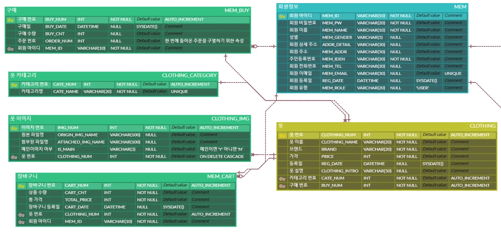

# 도서 쇼핑몰 - 개인 프로젝트 (3회차)

## 📌 프로젝트 소개
Spring Boot + React로 구현한 게임 아이템 기반의 쇼핑몰 웹 애플리케이션

**개발 기간:** 2025.08.13 ~ 2025.09.09  
**개발 인원:** 1명 (개인)

## 📈 학습 과정 (1회차 → 2회차 → 3회차)

| 구분 | 1회차 | 2회차 | 3회차 |
|------|-------|-------|-------|
| 기간 | 초기 학습 | 중간 복습 | 2025.08.13~09.09 |
| 백엔드 | Spring Boot | Spring Boot | Spring Boot |
| 프론트엔드 | React | React | React |
| DB | MariaDB | MariaDB | MariaDB |
| 특징 | 기본 CRUD | 반복 구현 | 각종 라이브러리 및 실시간 연습 |

> 같은 프로젝트를 3번 반복하며 **기술 내재화**와 **깊이 있는 학습**에 집중했습니다.

## 🛍️ 회차별 프로젝트 GIT링크
| 회차 | 프론트엔드 (React) | 백엔드 (Spring Boot) |
|------|--------------------|----------------------|
| 🧩 **1회차** | [🔗 frontend_shop](https://github.com/rush020114/workspace/tree/main/workspace_react/frontend_shop) | [🔗 backend_shop](https://github.com/rush020114/workspace/tree/main/workspace_spring/backend_shop) | 
| ⚙️ **2회차** | [🔗 frontend_shop (home)](https://github.com/rush020114/workspace/tree/main/workspace_react_home/frontend_shop) | [🔗 backend_shop (home)](https://github.com/rush020114/workspace/tree/main/workspace_spring_home/backend_shop) | 
| 🚀 **3회차** | [🔗 frontend_mem](https://github.com/rush020114/workspace/tree/main/workspace_react_home/mem) | [🔗 backend_mem](https://github.com/rush020114/workspace/tree/main/workspace_spring_home/mem) | 

---

## 🗂️ ERD (Entity Relationship Diagram)

프로젝트의 전체 데이터 구조를 시각적으로 표현한 ERD입니다.  
회원, 상품, 주문, 결제 등 주요 테이블 간의 관계를 한눈에 파악할 수 있습니다.  

  
.png)

---

## 🎯 주요 기능

### 사용자 필수 기능
.png)
- 회원가입, 로그인/로그아웃

### 상품 목록
.png)
- 상품 목록 조회 및 상세 보기
- 이미지 업로드

### 장바구니
.png)
- 장바구니 추가, 수정, 삭제
- 수량 조절 기능

### 주문 관리
.png)
- 주문 등록 및 조회
- 주문 상태 관리

### QnA (3차 추가)
.png)
- 질문 등록, 답변 작성
- 이미지 첨부 기능

---

## 🛠 기술 스택

**Backend**
- Spring Boot
- RESTful API
- MyBatis

**Frontend**
- React
- JavaScript
- HTML5, CSS3

**Database**
- MariaDB

**Tools**
- GitHub
- Notion
